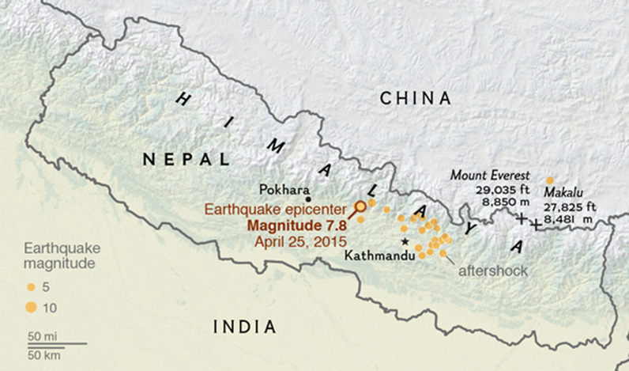
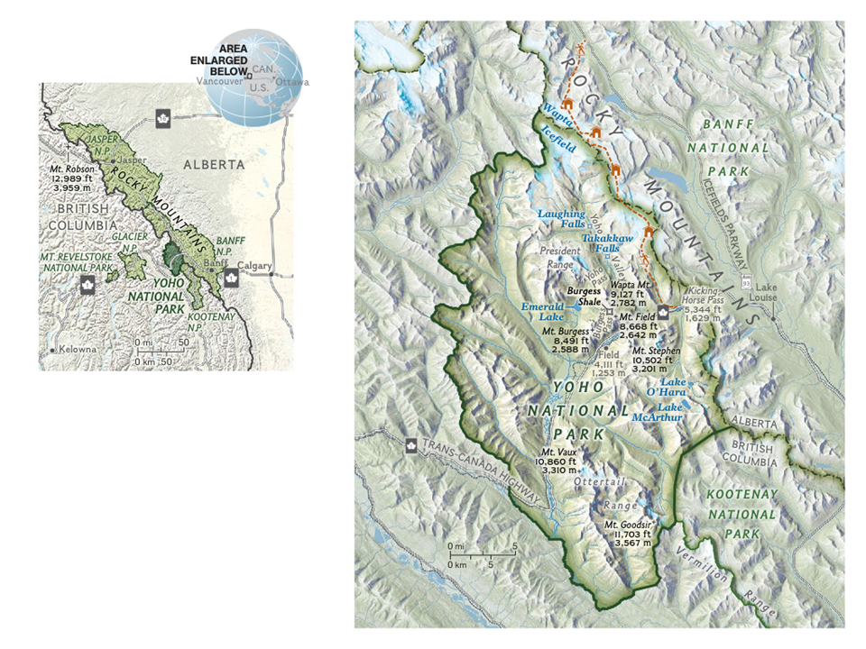
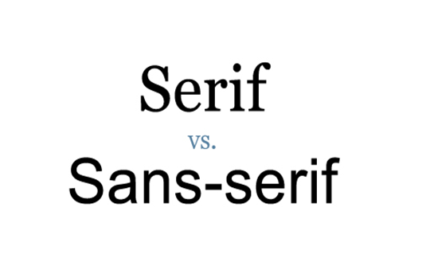
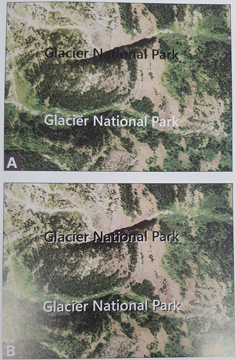
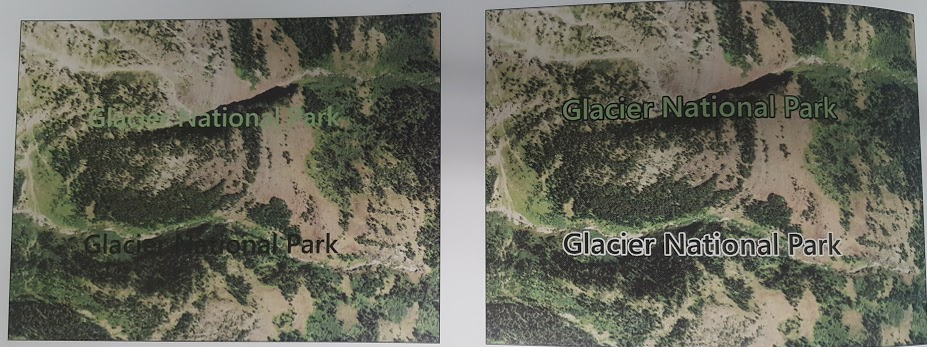
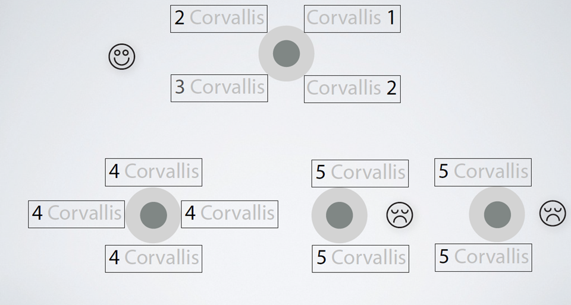
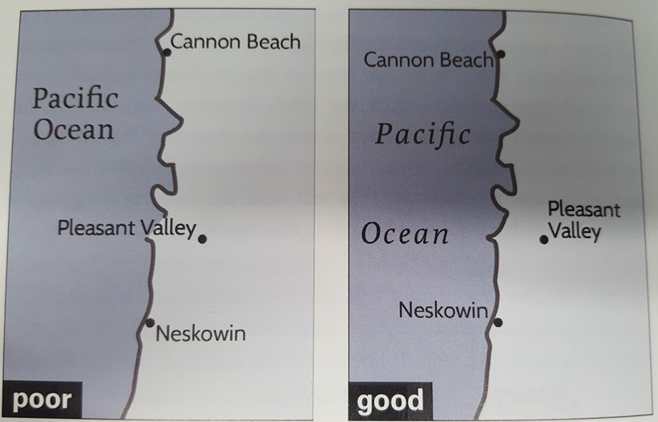
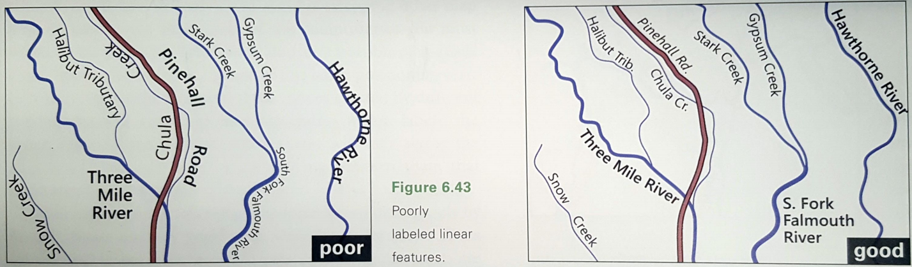
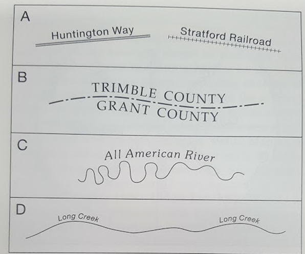

# **Labeling and topography**

> Spring 2017 | Geography 472/572 | Geovisualization: Geovisual Analytics
>
> Presenter: Paulo Murillo
>
> Instructor: Bo Zhao | TA: Kyle R. Hogrefe | Location: LINC 368 | Time: Tuesday/Thursday 9-9:50am

## **Labeling General rules**

1. Type size indicates relative importance

2. Use bolt type should be carefully considered(NOT underlying)

3. Use capital letters for countries, oceans and continents.

4. Water features are labeled using italics and in blue when color is used.
5. Normally use a single font

------

## **Fonts**

A typeface with **serifs** is called a **serif** typeface (or serifed typeface). A typeface without **serifs** is called sans-**serif** or sans **serif**, from the French sans, meaning "without".

## **Shadows**

Labels are difficult to read against the satellite image background. Shadows can help us to improve contrast.

## **Halos**

Improve contrast with the background. Never exaggerated the halo!

## **Type placement guidelines**

### **Points, Lines and Polygons**.

## **Label placement reference** (Points)

## Position could change!

Cities closer to ocean should be labeled over the ocean (left) while cities more inside continent should be labeled over land surface.

## Is Adams a river? Breaking lines can also works.

## **Label placement reference** (Lines)

So bad example of labels over rives and road.					Better distribution, spacing and type size.

## Labels over linear features

1. Labels should be above feature
2. Labels must follow general trend of the feature
3. Long linear features can be labeled more than once

## Label placement reference (Polygon)

# Topography

This image is an example of a hillshade created from raster data that has also been rotated to give a perspective view.

## Topography representation

### •Contours

### •Hypsometric tint (smooth or by classes)“DEM”

### •Terrain shading

## Shaded Relief  Terrain Representation

## Hypsometric tint + shaded relief

## Terrain exaggeration

## Resources 

Google Fonts [https://fonts.google.com](https://fonts.google.com/)[/](https://fonts.google.com/)

## References

•[https://](https://www.e-education.psu.edu/geog486/node/1874)[www.e-education.psu.edu/geog486/node/1874](https://www.e-education.psu.edu/geog486/node/1874)

•[http](http://www.reliefshading.com/)[://](http://www.reliefshading.com/)[www.reliefshading.com/](http://www.reliefshading.com/)

•[http://shadedrelief.com](http://shadedrelief.com/)[/](http://shadedrelief.com/)

•Brewer Cynthia. Designing Better Maps. Aguide for GIS Users.SecondEdition. 

•Slocum T, McMaster R., Kessler F., HowardH. Thematic Cartography and Geovisualization.Third edition. Editor:ClarkeKeith.

